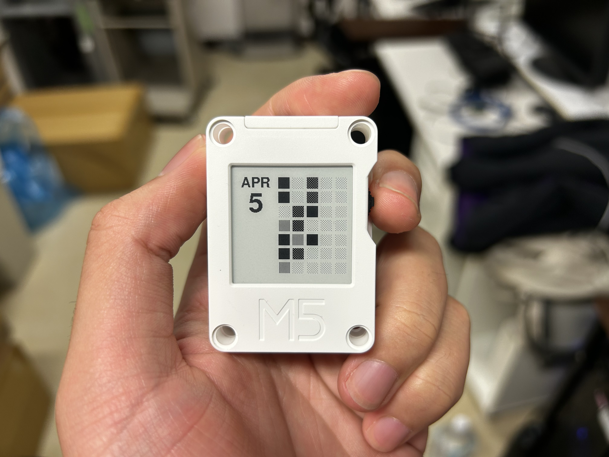

## **Leetcode Blocks for CoreInk**

A CoreInk project to show your Leetcode submission calendar.

## **Introduction**

This project is for [M5Stack CoreInk](https://docs.m5stack.com/en/core/coreink).
I’ve always enjoyed monitoring the progress of my tasks, as it gives me a sense of accomplishment.
This led me to wonder if I could extract my submission activity from LeetCode and display it. Since this type of update doesn’t need to be frequent, refreshing once a day is more than enough — an e-ink screen is an ideal fit for this purpose.
The current functionality includes:
1. Automatically fetching recent submission records from LeetCode CN (no account login required).
2. Updates every 4 hours (the maximum sleep interval allowed by CoreInk's API).

### **Screenshot:**

### **Libraries and Recommended Reads:**

1. [m5stack/M5GFX](https://github.com/m5stack/M5GFX)
2. [m5stack/M5Unified](https://github.com/m5stack/M5Unified)
3. [m5stack/M5Core-Ink](https://github.com/m5stack/M5Core-Ink)(Conflicts with M5Unified.)
4. [bblanchon/ArduinoJson](https://github.com/bblanchon/ArduinoJson)
5. [如何在不登录的情况下获取LeetCode-CN用户提交记录](https://blog.csdn.net/qq_32424059/article/details/106071201)

## **Installation and Usage**

Recommend to use [https://platformio.org/]PlatformIO for this project.

1. Create a new project in PlatformIO.

2. Add the following libraries:
    1. m5stack/M5GFX@^0.2.6
	2. m5stack/M5Unified@^0.2.5
	3. bblanchon/ArduinoJson@^7.3.1

3. Copy all the codes in [main.cpp](./src/main.cpp) to yours.(This project only has one file to edit.)

4. Build and upload to your CoreInk.

## **FAQ**

**Q:**
> How to configure my own infos?

**A:**
> You can change the configures at the beginning of the main.cpp.  
> #define WIFI_SSID "\*\*\*\*\*\*"  
> #define WIFI_PASSWORD "\*\*\*\*\*\*"  
> #define USERNAME "\*\*\*\*\*\*"  // Your Leetcode Username.  
> If necessary, you will need to handle the issue of **plaintext passwords** yourself.

## **Change log**

- **0.1.0(Arp.5 2024):** Initial release

## **License**

This is released under the MIT License.

## **Contact**

If you have any questions or comments about this project, please contact Shou Qiu (<qiusots@gmail.com>).